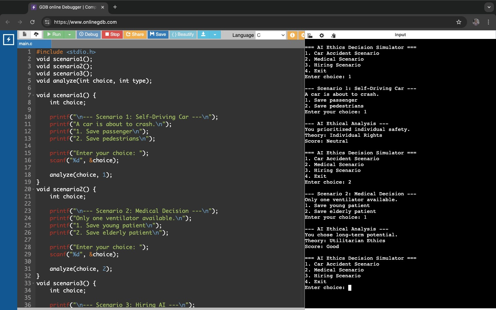
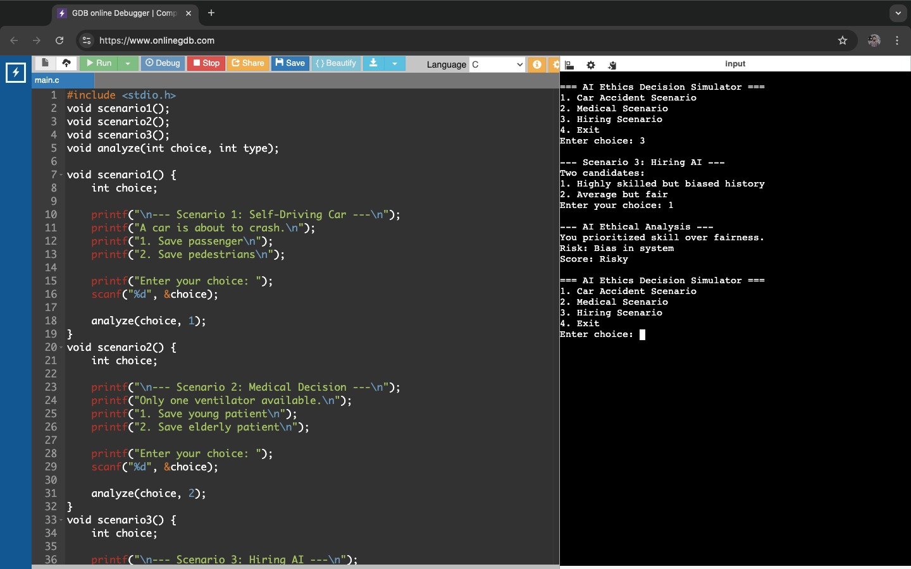
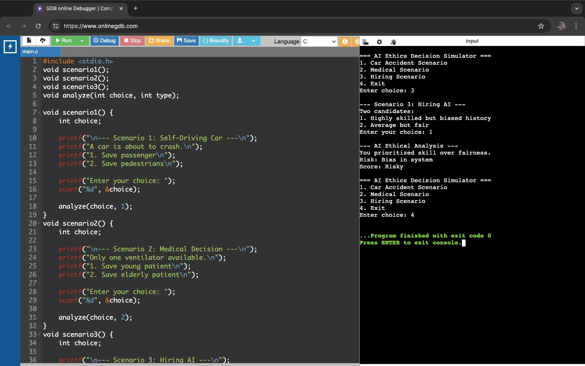

# AI Ethics Decision Simulator (C)

## Project Overview
This is a console-based application developed using the C programming language.  
It simulates ethical decision-making using a **rule-based AI system**. The system presents multiple real-life scenarios to the user, takes decisions, and provides an ethical analysis along with a scoring system.

The project is inspired by concepts from **Stanford AI Awakening: Implications for Society**.

---

## Features
- Multiple ethical scenarios:
  - Self-driving car accident
  - Medical resource allocation
  - AI hiring decision
- Take user decisions for each scenario
- Analyze decisions using rule-based AI logic
- Provide ethical explanation and scoring system
- User-friendly console interface

---

## Technologies Used
- C Programming  
- Console Application

---

## Project Screenshots

**Scenario 1: Self-Driving Car**  


**Scenario 2: Medical Decision**  


**Scenario 3: Hiring AI**  


**Sample Output**  


**Exit Output**  


---

## Learning Integration
This project is developed based on concepts learned from:

- Stanford AI Awakening: Implications for Society  
- Google Data Analytics  
- Google Project Management  
- IBM Software Engineering
- Microsoft Data Structure and Algorithm  

It demonstrates how ethical reasoning can be implemented using C programming in a console-based application.

---

## How to Run
1. Compile the program:
```bash
gcc ai_ethics_decision_simulator.c -o ethics
